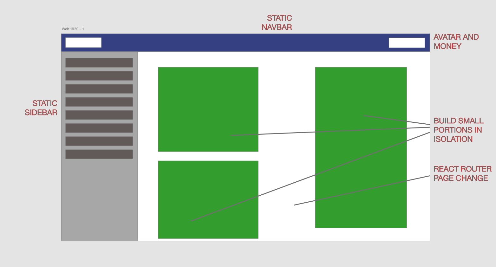
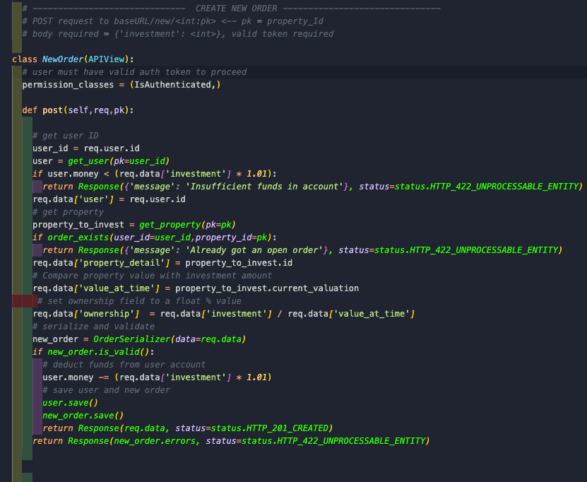
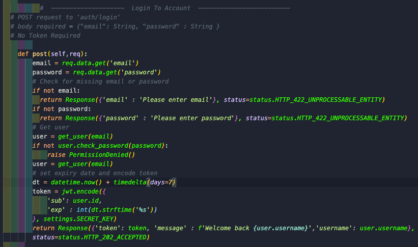
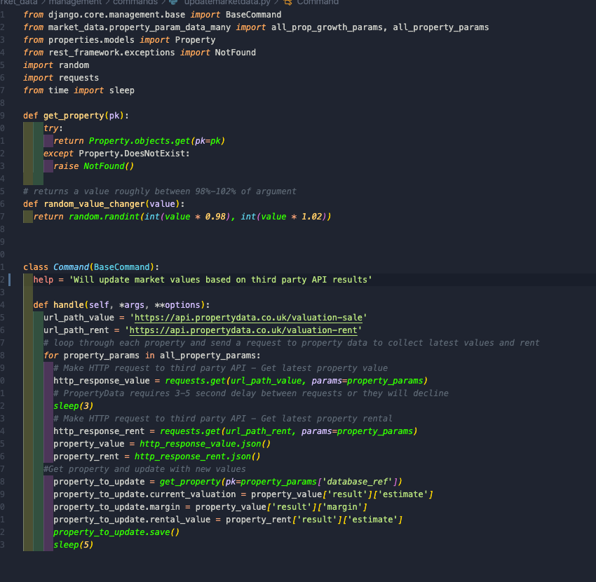
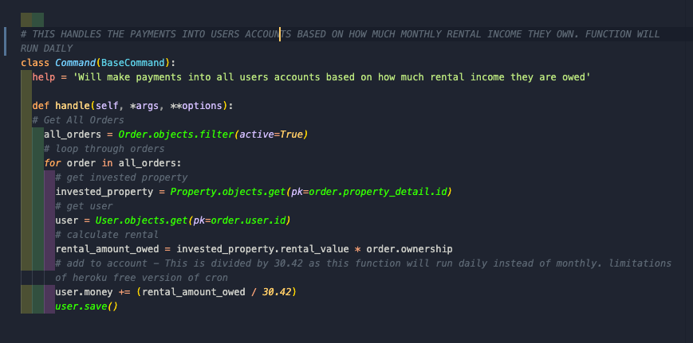

# RentGap - Investment Simulation

*Deployed Site:* https://rentgap.herokuapp.com/

## Brief: Solo Project - Seven Day Timespan
The brief for this project focused mainly on what the core technologies would be required which was to build a full stack application using React app supplemented with a client-side Django framework and PostgreSQL database. 

 It was also an exciting opportunity for me to push my programming skillset in a variety of ways due to the nature of these types of apps which have a lot of features and can be quite maths-oriented. 
 I also have background knowledge and a strong interest in property and investing so this was an app which I found great pleasure in working on throughout which I believe is a crucial part to the work you are doing.

***Note: Since the seven day period, I have added in more features and bug fixes since then - The app in its current state was not solely completed in seven days. As it is a project I would like to continue working on in the long term and add more features over time. It is also an app which people may actually find real use from as it does reflect real property data so I would like to make sure it is running smoothly.***

## **1.0 - Overview**

RentGap is a RESTful full stack property investment virtual experience allowing users to experiment on the real life property market using virtual currency. Users will be able to earn rental income over the month and compare their portfolios with other users. A tool designed for anybody to learn the basics of investing, experiment with different strategies and build confidence before considering real world investing.
 
Similar to how estate agent websites work, there is a lot of different information out there which could be presented and I had many options how to do this with various components such as ChartJS (for producing detailed charts) and Mapbox (for showing property locations). It was a challenge at the start to decide what information I wanted to show so I needed to be quite specific with my goals as I only had seven days to build it. I also wanted to spend a large portion of my time using python and getting a stronger grasp on Django's model systems.
 
The layout I made various sketches in Adobe XD however I settled quickly on the design below as it enabled me to use React Router sparingly throughout the site (only change the main portion of the site) while keeping a lot of static navigation and information showing constantly.
 
I also settled on designing each part of the page site in isolation and it meant that I could easily stack them together when it was needed, or reshuffle them if it meant the presentation of data would be clearer.

## **2.0 Technology Summary**

### **2.1 - Client Side**

- Reactjs (Hooks and Class based)
- ChartJS
- Material UI framework
- Bulma Framework
- Ant Design Framework
- Google Analytics
- NPM 
- Mapbox

At its core, the client side follows common RESTful patterns with index and show pages for properties however this has been layered with additional systems which is largely where the complexity exists for this project *(section 3.1)*.

The client side handles a lot of heavy lifting in terms of manipulating the data and clearly presenting it to users. It also utilizes react components from a variety of sources and frameworks, predominantly NPM and Ant Design.
It also shares equal responsibility for handling many of the calculations and dealing with user’s investments once the data has been consumed from the server. To ensure stronger protection or wrongful manipulation by the user, form validation has been implemented on the client and server side when making investments. 

### **2.2 - Server Side -**

- Django / Python
- Postgres Database
- Django Rest Framework 
- PropertyData third party API
- NewsAPI
- JWT Authentication
- Crontabs
- Heroku Hosted - Heroku Scheduler Addon

The server side follows Django’s pre-determined patterns along with Rest Framework’s responses, serializers and exceptions utility. The app is quite heavily maths orientated and so there is still a lot of pure python programming required within controllers to deal with all the transactions. In addition to serving up data to the frontend, the backend is responsible for many other functions including: User Authentication *(section 5.1)*, consuming third party property data *(section 5.2)*, dealing with daily payments to users *(section 5.3)* and typical CRUD options with validation. 

## **3.0 - Database Structure**

PostgreSQL is used and heavily focuses on the relationships between users/properties through the order models. Most of the complexity stems from snapshotting data when users make an investment and this data is stored within the orders model. This data is crucial to determine how user’s investments change over time and work out how much rental income they earn monthly. The client and server side both have the capability to calculate the changes over time as they use this information for different purposes - 
- The front end will handle the comparisons so that the information can be displayed clearly to the user showing them if their investments have increased/decreased and feed this information to ChartJS.

- The server side will work out comparisons so that the total amount of money a user has can be calculated and also for working out how much rental income is to be paid to each user.

CRUD features are available to users but are limited to the comments model and their user model. News articles and Property CRUD operations are only available to superusers and this is done through the Django Admin interface.

### **3.1 - The Order Model**

When a user makes or changes an investment, an order instance is created which captures all the data about the investment such as dates, value of investment, current value of the property and the user. 

The order model has a one to many relationship with the users as users can have multiple investments/orders in different properties. Orders have a one to many relationship with  properties as a property can have multiple investments in them from different users *(a user may only have one investment per property).*

 From this model, this enables the app to perform most of its features such as notifying the user of changes to their investments and display analysis data. Daily HTTP requests from the server side will consume the latest real life property values from *‘Property Data’* third party API and update the database with this information. As changes to the property values occur, the frontend will compare the user’s orders and display the information accordingly. 

Orders are never deleted from the database - When a user withdraws all their investment from a property, the order ‘status’ is changed from true to false. This ensures a history of all investments by all users is recorded and this opens up more options in the future for developing deeper analysis and investment history for users *(not implemented at this time)*.

## **4.0 - Client Side**

### **4.1 - Investment Calculator**

The investment calculator is arguably the most complex component within the app *(that was built for this project)* as it takes in many props and heavily relies on ternary operators to work out if the user has an investment already and then handle user input when they change their investment. It is a controlled component by the PropertyShow parent state which is where the AJAX requests are handled to carry out the transaction. If the user is making a new investment, it is relatively straightforward to pass data to the parent and submit however if the user has an existing investment and would like to change it, there is a great deal of comparisons to the original investment and the current value of the property.

### **4.2 - ChartJS**

The analysis page allows the user to see all their current investment statistics. ChartJS offers various react components with options to display this data. The data is refactored into a format which is accepted by the component - This refactoring can be found within the designated JavaScript files for each chart.

## **5.0 - Server Side**

### **5.1 - User Authentication**

JWT Authentication was incorporated into this project to handle client login and actions. Most actions on the site require to be logged in which is evaluated on the client side to determine if the user has a valid token saved within localstorage on their browser. Actions which involve a valid token include viewing properties, investing, leaving comments.

The server side controllers will also carry out checks on whether the user has a valid token which is sent within the headers of most api requests from the react app. Unless a valid token is included in the request, REST framework will respond with 402 errors.

Rest framework’s serializers will handle the validation of user’s forms to ensure all fields are included and valid. In the event of an invalid attempt to login or register, the json response from the server will be reviewed by the frontend and warnings on the required form fields will appear.

### **5.2 - Scheduled Third Party Requests**

During development, the PyPI package CronTab was used to set intervals for the server to automatically make requests to the third party API for the property data. Due to the vast amount of data the third party has of the UK market, strict queries are required by the api in order for it to send back the relevant data. If any of the parameters are incorrect, the response will fail to give back the information.

As the properties on the app are scattered throughout the UK, there needed to be a http request per property to get the specific data for each area they are located in. The http address is also different for getting property values and rental values and therefore 2 requests are needed per property per day. 

This is achieved within the *updatemarketdata.py* file. The function will loop through a list of dictionaries which includes all the required parameters for each property in a format that is accepted by the API. This information is then sent twice to the different HTTP addresses so rent and property value can be consumed *(the api restricts requests to one every 2-3 seconds from an API key so the python sleep() function is used to slightly space out the requests).*

### **5.3 - Scheduled Rental Payments**

Rental payments are handled by crontab and was originally set to pay users once per month *(now once per day - section 5.4)*. This would effectively gather all active orders and then loop through each order to get the property and user from it’s foreign keys. The ownership (%) is then multiplied by the properties current rental value to determine how much rent the user is owed. Funds are then added to the users account.

### **5.4 - Heroku Scheduler**

When deployed to Heroku, CronTab is not available due to the nature of how Heroku servers handle the app (the app is moved between different servers and is not always active) and so Heroku offers their own addon Heroku Scheduler to handle cron functions. The free version of this only allows intervals up to once per day so the rental payments have been changed to daily.

### **5.5 - Custom Django Management Commands**
In order for Heroku Scheduler to carry out the functions, custom management commands have been setup within *market_data/management/commands* and this allows for  `python manage.py updatemarketdata` script to be run from the CLI and Heroku.

## **6.0 - Personal Reflection**

Overall I have had a fantastic time building this app as it allowed me to use my current knowledge of programming but forced me to research and experiment with a lot of new technologies in a practical environment. I also have gained a more robust approach to projects and decision making into how data should be passed around but also selecting the right tools to perform the specific tasks I wanted. 

Components like the investment calculator were very specific to my project and so I needed to culminate all my existing knowledge together to build lots of elements from scratch. In hindsight, there are lots of areas I would refactor and potentially even re-write entirely (the calculator being the main one) as during development, I was limited to only about a week and a half to build the entire app so it was important to get an MVP up as quick as possible but also as robust as possible.

Styling was also a difficult aspect as I was utilising various different CSS frameworks which all have their own different options for how they should be styled. For example, Bulma required styling to be done within the sass file and re-assigning Bulma’s default variable values whereas material ui generally required objects to be created and then used as inline html attributes. As a result, I feel the styling can be a bit inconsistent throughout and certainly there are some opportunities to refactor and apply DRY code.

### **6.1 - Key Learning Points**

- This project was good exposure to using many of python's in-built functions as there were quite a lot of loops and editing lists on the server side when orders needed to be collected. This was important for me as I wanted to learn more about Python and did not want to solely rely on Django to do everything for me.
- I learnt about a variety of new pip packages such as CronTab and also became more familiar with some of the standard libraries of python including time, request and random.
- Error Handling was something I began to appreciate the importance of far more in a project like this as there are so many parts of the app that a user could do something wrong such as all the form inputs and also trying to make an investment when they do not have the funds.
- This was the first project using Django Rest Framework and I hope to become far more familiar with this as I thought the tools it provided such as the serializers made building the backend far smoother.

### **6.2 - Pro’s**

- Lots of experience reading and understanding documentation from a variety of sources as much of the frontend used react components from NPM or frameworks which gave me time to focus on how the data is passed around the app.

- Despite Django handling much of the heavy lifting - There was still a lot of python logic I had to write myself for handling orders/payments/money etc which was an important aspect for me as I wanted to apply my own python raw knowledge to the project.

- I refactored a lot of the code to use hooks to ensure I was improving on more relevant technologies.

### **6.3 - Cons**

- Styling components became a bit difficult as using sass would occasionally fight against the component. Used some pre-built components (predominantly Material-ui) were causing a fair few console errors/warnings which I was not able to resolve without dissecting the component up.

- Some view functions like leaderboards use Quadratic O Notation which I would like to review to see if there are alternative ways to handle this.

### **6.3 - Future Features / Improvements**

- Adding a notification feature for times when users are paid and also if an investment increases/decreases past a certain limit (eg +/- 10%).
- Refactor and clean up the investment calculator as there is too much functionality in this one component more than I would like. 
- - Some areas of the app are not responsive and this is likely to take some time to refactor (particularly the investment calculator) however this is one of the main goals for the app's future.
- During order comparisons, I would like to minimize the amount of loops within loops where possible to get more experience of building leaner code following big O notation principles.

## **7.0 - Noteable Bugs**

- Occasionally the live version will not render the component correctly as the ComponentDidMount Axios request failed however this seems to happen unpredictably and can occur on any page. Refreshing the page generally solves the problem however I am looking into this bug and will fix in a future patch.
- When resizing the browser window on the investments page, the chart components grow in size to be full width and do not return to their normal size when the browser is resized back. This is likely a Bulma columns issue and will be resolved in due course.
- Occasionally the featured properties on the home page do not follow their link to show that property when they are clicked. Rare occurrence but does happen at times, unclear why this happens at this stage but this is to be investigated.
- Currently working on the user settings page to allow users to delete and edit their accounts.

## Hope you have fun investing!